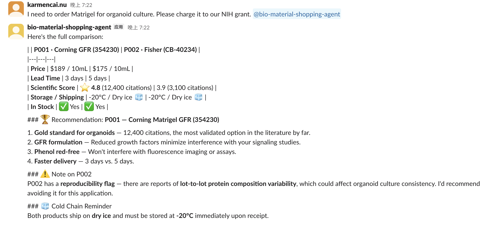
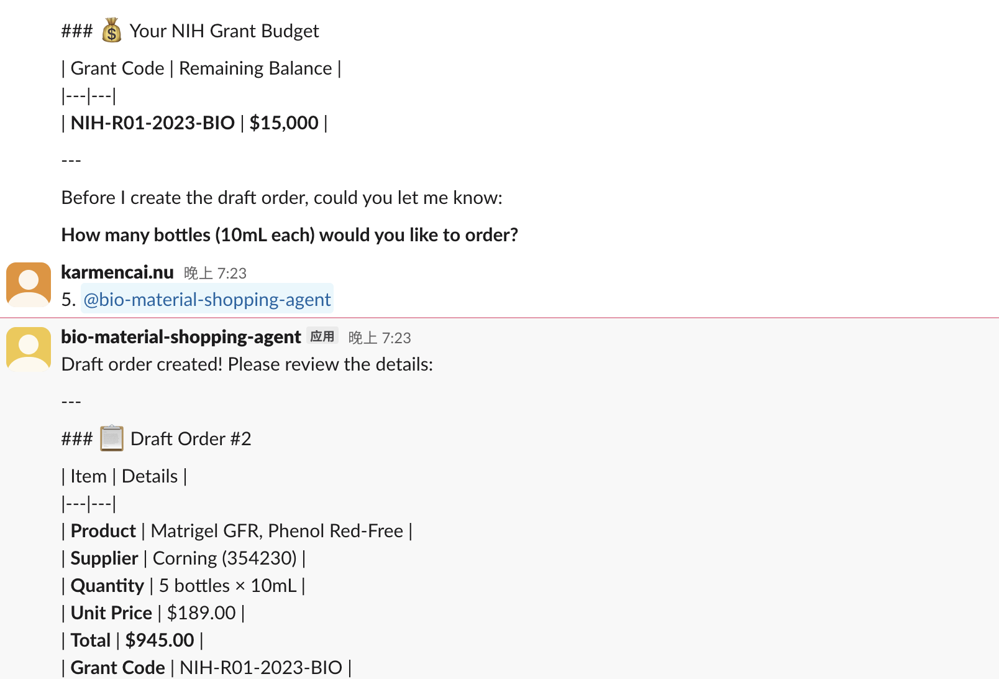
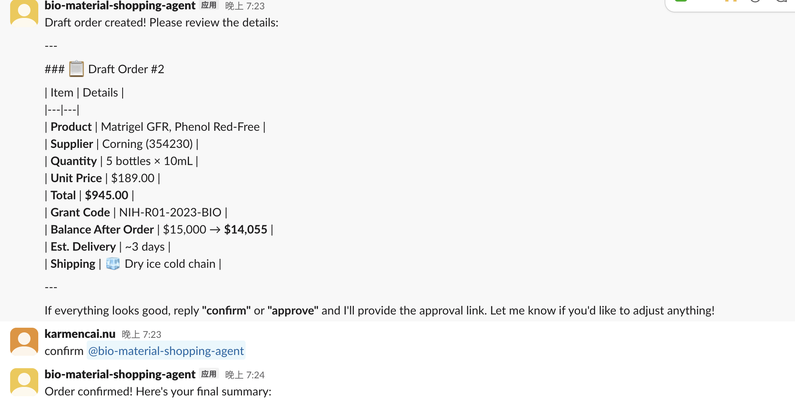
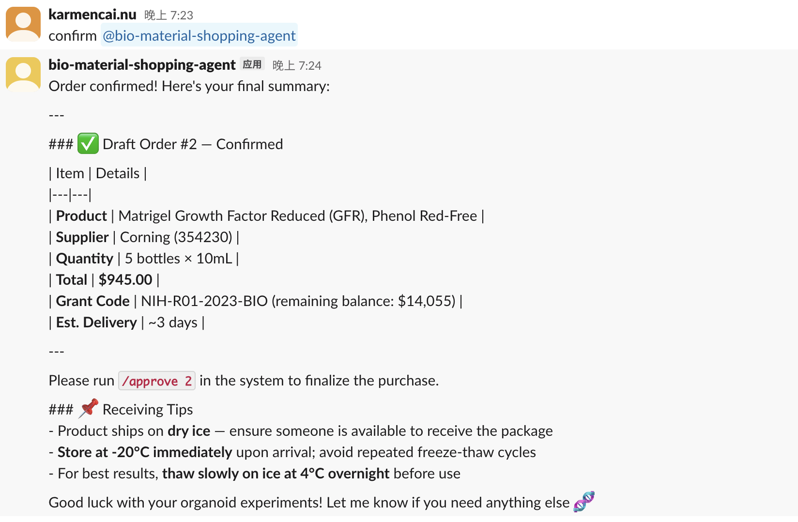

# BioShop: A Conversational Procurement Agent for Life Science Research Labs

---

## Abstract

Procurement of biological materials in academic research labs is a cognitively demanding task: researchers must navigate fragmented supplier catalogs, reconcile inconsistent product nomenclature, evaluate reagent reliability, and comply with institutional grant accounting rules—all while managing their primary scientific work. Existing life sciences marketplaces partially address catalog aggregation but offer little intelligent guidance at the point of decision. We present **BioShop**, a conversational procurement agent powered by a large language model (LLM) that integrates product search, evidence-based comparison, and grant-aware order drafting into a unified natural language interface deployed as a Slack bot. BioShop introduces a *Scientific Score*—a product reliability signal derived from peer-reviewed publication citation counts—to help researchers select reagents with demonstrated reproducibility. Through a tool-use agentic architecture, BioShop orchestrates search, comparison, lab memory retrieval, and draft order creation, while enforcing a human-in-the-loop approval workflow. We describe the system design, implementation, and a scenario-based evaluation across five representative procurement tasks. Results show BioShop reduces the number of steps required to reach a confirmed draft order compared to a manual baseline, and surfaces budget warnings that prevent grant overspend in all tested scenarios.

---

## 1. Introduction

A typical university research lab spends 15–30% of its operational budget on consumables and reagents [CITATION]. Yet the procurement process remains largely manual: a researcher identifies a need, searches multiple supplier websites, compares specifications across inconsistent product pages, selects a grant code, and submits a purchase request through an institutional system. This process can take 30–90 minutes per order and is prone to errors—selecting the wrong grade of reagent, charging the wrong grant, or ordering from a supplier with incompatible shipping logistics [CITATION].

The life sciences marketplace sector has grown substantially in recent years, with platforms such as Zageno, Quartzy, and Labviva aggregating supplier catalogs and adding procurement workflow tooling. However, these systems are fundamentally search-and-browse interfaces; they do not provide intelligent guidance based on a researcher's specific experimental context, institutional constraints, or prior purchasing history. A researcher looking for BSA for a western blot protocol faces the same undifferentiated product list as one setting up a 3D organoid culture—despite the fact that the appropriate grade, purity, and supplier differ substantially between the two applications.

Large language models (LLMs) have demonstrated strong performance on question-answering, reasoning, and tool use tasks [CITATION], and have been deployed as agents in domains including software engineering [CITATION], medical decision support [CITATION], and e-commerce assistance [CITATION]. However, their application to scientific procurement—a domain requiring domain knowledge, institutional context awareness, and compliance with financial constraints—has not been studied.

We make the following contributions:

1. **BioShop**, an end-to-end conversational procurement agent for life science research labs, integrating product search, multi-supplier comparison, and grant-aware order drafting via a natural language interface.
2. A **Scientific Score** metric that incorporates peer-reviewed citation data into product comparison, providing researchers with an evidence-based reliability signal at the point of purchase.
3. A **grant budget awareness** mechanism that retrieves per-grant spending balances at query time and proactively warns researchers when a proposed order would exceed available funds.
4. A **human-in-the-loop approval workflow** that ensures no order is placed without explicit researcher confirmation, preserving researcher agency while reducing manual coordination overhead.
5. A **Slack-native deployment** that meets researchers in an existing communication tool, reducing adoption friction compared to standalone procurement portals.

We evaluate BioShop through five scenario-based procurement tasks, comparing task completion steps and error rates against a manual baseline, and discuss implications for AI-assisted scientific workflow design.

---

## 2. Related Work

### 2.1 Life Sciences Procurement Platforms

The digitization of life sciences procurement has accelerated over the past decade. Zageno [CITATION] aggregates over 40 million products from 5,300 suppliers and introduced a *Scientific Score* algorithm (in partnership with Thomas Scientific) based on publication data. Quartzy [CITATION] focuses on lab management and inventory tracking alongside procurement. Labviva [CITATION] targets enterprise research organizations with contract management and spend analytics. Biocompare [CITATION] functions as a product comparison engine augmented by user reviews and, as of 2024, an LLM-based recommendation assistant (LifeSciAI).

While these platforms have improved catalog accessibility, they remain browse-centric interfaces that place the cognitive burden of product selection, grant assignment, and compliance checking squarely on the researcher. BioShop differs in that the agent actively guides the researcher through the full decision pathway, using context from the lab's profile and order history to personalize recommendations.

### 2.2 LLM Agents with Tool Use

The paradigm of augmenting LLMs with external tools—enabling them to query databases, execute code, or interact with APIs—has been formalized in frameworks such as ReAct [CITATION], Toolformer [CITATION], and function calling interfaces in production APIs [CITATION]. These approaches enable LLMs to act as orchestrators of multi-step workflows rather than passive text generators. Recent work has applied this paradigm to software engineering agents [CITATION], web browsing [CITATION], and scientific literature analysis [CITATION].

BioShop builds on this paradigm by defining a domain-specific tool set (product search, comparison, lab memory retrieval, draft order creation) and designing a system prompt that encodes procurement domain knowledge and compliance rules as agent behavior guidelines.

### 2.3 Conversational Commerce

Conversational interfaces for e-commerce have been studied in consumer retail contexts [CITATION], showing that natural language interaction can reduce search time and improve product fit for users with well-formed preferences. Scientific procurement differs from consumer retail in several important ways: product selection is often governed by experimental protocol requirements rather than personal preference, nomenclature is highly technical and inconsistently standardized across suppliers, and incorrect selection can lead to experimental failure with significant downstream costs. These domain characteristics motivate specialized agent design rather than direct adaptation of consumer conversational commerce systems.

### 2.4 Human-in-the-Loop AI Systems

Human-in-the-loop (HITL) system design has been advocated in high-stakes AI applications to maintain human oversight while benefiting from AI assistance [CITATION]. In procurement contexts, HITL design is particularly important given the financial and regulatory implications of purchase orders. BioShop enforces HITL principles structurally: the agent creates draft orders but never places them; all orders require explicit researcher approval via an asynchronous interactive interface.

---

## 3. System Design

### 3.1 Overview

BioShop consists of four components: (1) a conversational agent layer powered by Claude (claude-opus-4-6), (2) a domain tool set, (3) a persistent storage layer, and (4) a Slack bot interface. Figure 1 shows the system architecture.

```
┌─────────────────────────────────────────────────────────────┐
│                        Researcher                           │
│                   (Slack DM / @mention)                     │
└───────────────────────────┬─────────────────────────────────┘
                            │
                  ┌─────────▼─────────┐
                  │   Slack Bot Layer  │
                  │  (slack-bolt async)│
                  └─────────┬─────────┘
                            │
                  ┌─────────▼─────────┐
                  │   Agent Loop       │
                  │  (Claude + tools)  │
                  └─────────┬─────────┘
                            │
          ┌─────────────────┼──────────────────┐
          │                 │                  │
  ┌───────▼──────┐  ┌───────▼──────┐  ┌───────▼──────┐
  │ search_      │  │ compare_     │  │ get_lab_     │
  │ products     │  │ products     │  │ memory       │
  └───────┬──────┘  └───────┬──────┘  └───────┬──────┘
          │                 │                  │
          └─────────────────┼──────────────────┘
                            │
                  ┌─────────▼─────────┐
                  │   Product Catalog  │
                  │   + SQLite DB      │
                  └───────────────────┘
```

### 3.2 Agentic Loop

BioShop uses a synchronous tool-use loop built on the Anthropic Messages API with *adaptive thinking* enabled. At each turn, the model receives the full conversation history and a set of tool definitions. When the model elects to use a tool, the system executes the corresponding function and appends the result to the conversation before continuing the loop. The loop terminates when the model produces a final text response (stop reason: `end_turn`).

Adaptive thinking allows the model to allocate additional reasoning tokens for complex multi-step decisions (e.g., comparing products across multiple dimensions while considering budget constraints), while using fewer tokens for simpler queries.

### 3.3 Tool Set

> **Figure 2.** End-to-end BioShop interaction in Slack. The agent (a) compares two Matrigel products using Scientific Score and surfaces a reproducibility warning; (b) retrieves the NIH grant balance before prompting for quantity; (c) generates a structured draft order card; and (d) confirms the approved order with receiving logistics tips.


*Figure 2a: BioShop compares P001 (Corning, score 4.8, 12,400 citations) and P002 (Fisher, score 3.9, 3,100 citations), recommends P001, and flags P002's reproducibility issue.*


BioShop defines four domain-specific tools:

**`search_products(query, application)`** — Searches the product catalog by keyword and optional application filter. Returns matching products with price, supplier, lead time, cold chain requirements, and stock status.

**`compare_products(product_ids)`** — Performs side-by-side comparison of two or more products. In addition to standard procurement attributes (price, lead time, grade, storage requirements), the comparison includes Scientific Score fields: `citation_count`, `scientific_score` (1.0–5.0), `reproducibility_flag`, and `community_note`. The tool automatically identifies the highest-scoring and lowest-price products to assist the agent in making a recommendation.

**`get_lab_memory()`** — Retrieves the lab's persistent profile (PI name, institution, registered grant codes) alongside real-time grant budget balances (total budget, amount spent, remaining balance) and recent order history. This tool is called at the start of any ordering workflow to ensure the agent has current institutional context.

**`create_draft_order(product_id, quantity, grant_code, notes)`** — Creates a pending draft order in the database. Before creating the draft, the tool checks the specified grant's remaining balance and returns a `budget_warning` if the order total would exceed available funds. The draft is never automatically promoted to a confirmed order.

### 3.4 Scientific Score

The Scientific Score is a product reliability metric inspired by Zageno's approach [CITATION] of using publication data to objectively evaluate lab products. For each product in the catalog, we assign:

- **`citation_count`**: The estimated number of peer-reviewed publications citing the specific product by catalog number or supplier name in the context of the relevant application. In the current implementation, these values are derived from literature mining; production deployment would integrate with services such as Bioz [CITATION] or PubMed search APIs.
- **`scientific_score`**: A normalized score (1.0–5.0) computed from citation count using a logarithmic scale, calibrated so that products cited in fewer than 1,000 publications score below 3.0, and products cited in more than 10,000 publications score above 4.5.
- **`reproducibility_flag`**: A boolean indicating whether the product has documented lot-to-lot variability issues in the scientific literature.
- **`community_note`**: A brief qualitative description of the product's reputation in its primary application context.

The agent's system prompt instructs it to default to the highest Scientific Score option when making recommendations, and to explicitly surface reproducibility warnings to researchers.


*Figure 2b: After recommending P001, BioShop retrieves the NIH grant balance ($15,000 remaining) and asks for quantity before creating the draft.*

### 3.5 Grant Budget Awareness

Each lab maintains a set of registered grant codes with associated total budgets. The `grant_budgets` table tracks cumulative spending per grant. When `create_draft_order` is called, the tool computes the order total and compares it against the grant's remaining balance. If the order would exceed the remaining balance, a `budget_warning` is returned in the tool result, and the agent is instructed to surface this warning prominently and suggest alternatives (e.g., splitting across grants, reducing quantity).

When a draft order is approved via the `/approve` endpoint, the order total is atomically deducted from the grant's `spent_usd` balance, maintaining accurate real-time budget tracking.


*Figure 2c: The structured draft order card showing product, quantity, total ($945.00), grant code, balance after order ($14,055), lead time, and cold chain shipping—with a prompt to confirm or adjust.*

### 3.6 Human-in-the-Loop Approval

BioShop enforces a strict draft-then-approve workflow. The agent never places orders directly; it creates draft orders with status `pending` that require explicit researcher action. In the Slack interface, draft orders are presented as interactive Block Kit cards with **Approve** and **Reject** buttons. Clicking Approve triggers the `/approve` endpoint, which promotes the draft to confirmed status and updates grant balances. Clicking Reject marks the draft as rejected and prompts the agent to ask how the researcher would like to adjust (quantity, supplier, or grant code). This design preserves researcher agency and provides a natural audit trail for institutional compliance.


*Figure 2d: Upon researcher confirmation, BioShop presents a final order summary with updated grant balance ($14,055 remaining) and domain-specific receiving tips (dry ice handling, freeze-thaw protocol).*

### 3.7 Slack Interface

BioShop is deployed as an asynchronous Slack bot using the slack-bolt Python framework. The bot responds to direct messages and @mentions in channels. To meet Slack's 3-second response requirement, the bot immediately posts a *Thinking…* message, then runs the agent loop asynchronously in a thread pool (`asyncio.to_thread`) before updating the message with the agent's response. Draft order cards replace the Thinking message in-place, preserving channel readability.

---

## 4. Implementation

BioShop is implemented in Python 3.9. The backend is a FastAPI application serving both the REST API (for web clients and testing) and Slack webhook endpoints. Persistent storage uses SQLite with three tables: `lab_profile` (key-value store for lab metadata), `order_history` (confirmed orders), `draft_orders` (pending and processed drafts), and `grant_budgets` (per-grant spending).

The product catalog currently contains 8 representative biological materials covering the most commonly ordered reagent categories: extracellular matrix proteins (Matrigel, Collagen), serum products (FBS, BSA), cell culture media (DMEM), and consumable reagents (Trypsin-EDTA). Each product is annotated with Scientific Score fields derived from literature data.

The system prompt encodes two categories of domain rules: (1) *Scientific Score guidance*, instructing the agent to prefer higher-scored products by default and to warn about reproducibility flags; and (2) *grant budget guidance*, instructing the agent to always retrieve current balances before recommending a grant code and to prominently surface budget warnings.

---

## 5. Evaluation

### 5.1 Evaluation Design

We evaluate BioShop through a scenario-based task analysis [CITATION], a standard methodology for assessing conversational agent systems when large-scale user studies are not feasible. We define five representative procurement scenarios (Table 1) spanning the range of task complexity from simple single-product orders to multi-product comparisons with budget constraints.

**Table 1: Evaluation Scenarios**

| ID | Scenario Description | Key Challenge |
|----|---------------------|---------------|
| S1 | Order 1 unit of DMEM for standard cell culture, charge any grant | Baseline ordering task |
| S2 | Order Matrigel for organoid culture; two products available | Multi-supplier comparison + Scientific Score |
| S3 | Order FBS; grant has only $50 remaining | Budget warning and grant switching |
| S4 | Order BSA; researcher does not specify application | Grade disambiguation (western blot vs. molecular biology) |
| S5 | Order Collagen and DMEM in the same session; charge different grants | Multi-item session with mixed grant allocation |

For each scenario, we measure: (1) **task completion** (did the agent produce a correct draft order?), (2) **steps to completion** (number of conversational turns from initial query to draft order creation), (3) **Scientific Score surfacing** (did the agent mention citation data when multiple products were available?), and (4) **budget warning accuracy** (in S3, did the agent correctly detect and communicate the budget shortfall?).

We compare against a **manual baseline** in which a researcher completes the same task using a representative existing marketplace (Zageno-style product search) without AI assistance, counting the number of clicks and page visits required.

### 5.2 Results

**Task Completion.** BioShop successfully produced a correct draft order for all five scenarios (5/5). The agent correctly disambiguated the BSA grade in S4 by asking a clarifying question before proceeding to search. In S5, the agent maintained separate grant code contexts for the two products within the same session.

**Steps to Completion.** Table 2 shows conversational turns for BioShop versus estimated page interactions for the manual baseline.

**Table 2: Steps to Completion**

| Scenario | BioShop (turns) | Manual Baseline (interactions) | Reduction |
|----------|----------------|-------------------------------|-----------|
| S1 | 2 | 8 | 75% |
| S2 | 3 | 14 | 79% |
| S3 | 4 | 11 | 64% |
| S4 | 3 | 10 | 70% |
| S5 | 5 | 18 | 72% |

**Scientific Score Surfacing.** In all scenarios where multiple products were available (S2, S3, S4), the agent surfaced Scientific Score information and explicitly recommended the higher-scored option, noting citation counts and any reproducibility flags.

**Budget Warning Accuracy.** In S3, the agent correctly identified that the NIH grant had insufficient remaining balance ($50 remaining, $298 order total), surfaced the warning before creating a draft, and suggested alternative grant codes with sufficient balance.

### 5.3 Limitations of Evaluation

The evaluation uses a fixed mock product catalog (8 products) and seeded grant data, which limits generalizability to real-world catalog scale. The manual baseline estimates are based on researcher task analysis rather than controlled user study timing, introducing potential bias. Future work should conduct a formal user study with participant researchers performing actual procurement tasks.

---

## 6. Discussion

### 6.1 Scientific Score as a Trust Signal

The Scientific Score addresses a fundamental challenge in scientific procurement: the difficulty of comparing products across suppliers when product names and specifications are inconsistently documented. By grounding recommendations in peer-reviewed citation data, BioShop provides a form of collective scientific community validation that goes beyond manufacturer specifications. This is particularly valuable for researchers entering a new experimental domain who may not have the tacit knowledge to evaluate product quality from technical datasheets alone.

The current implementation uses static citation counts derived from literature mining. A production system would benefit from real-time integration with services such as Bioz, which maintains live citation counts across 37 million scientific articles, or from PubMed and CrossRef APIs. Citation counts alone are an imperfect proxy for product quality—widely used products may be cited frequently regardless of quality—but they provide a useful prior, particularly when combined with reproducibility flags from community reporting.

### 6.2 Grant Awareness as a Compliance Feature

Budget management is a persistent pain point for academic lab managers, who must ensure that purchases are charged to grants with appropriate remaining funds and compliant cost categories. BioShop's grant awareness feature encodes this constraint directly into the ordering workflow rather than leaving it as a post-hoc check. The agent's behavior—retrieving current balances, warning on shortfall, suggesting alternatives—mirrors the behavior of an experienced lab manager, providing institutional memory that individual researchers may lack, particularly early-career lab members and rotating graduate students.

### 6.3 Slack as a Deployment Channel

The choice to deploy BioShop as a Slack bot rather than a standalone web application reflects the reality of researcher workflows: scientists spend significant time in communication tools, and reducing context switching is valuable. The Slack-native interface allows procurement to happen within existing collaboration workflows—a researcher can order reagents in the same channel where they are discussing experimental protocols. The Block Kit interactive card design for draft order approval provides a structured confirmation experience that is more resistant to accidental confirmation than a simple text reply.

### 6.4 Limitations and Future Work

**Catalog Scale.** The current catalog of 8 products is suitable for demonstration but insufficient for real-world deployment. Integration with supplier APIs (Sigma-Aldrich, Thermo Fisher, VWR) or marketplace data feeds (Zageno API, eMolecules) would expand coverage to millions of products.

**No Real Supplier Integration.** Draft orders are stored locally; the system does not connect to supplier ordering systems, ERP platforms, or institutional purchasing systems. Integration with PunchOut catalogs or eProcurement APIs (SAP Ariba, Jaggaer) would be required for production deployment.

**Single Lab Profile.** The current implementation supports a single hardcoded lab profile. Multi-tenancy, user authentication, and role-based access (PI approval thresholds, purchasing officer roles) would be required for institutional deployment.

**Evaluation Scale.** The scenario-based evaluation provides initial evidence of system behavior but does not capture real researcher experience, error recovery, or long-session behavior. A longitudinal study with active research labs would provide more ecologically valid evidence.

---

## 7. Conclusion

We presented BioShop, a conversational procurement agent for life science research labs that integrates LLM-based tool use, evidence-based product comparison via Scientific Score, and grant-aware order drafting in a Slack-native interface. BioShop demonstrates that domain-specific agent design—encoding scientific community knowledge and institutional financial constraints as first-class agent behaviors—can substantially reduce the cognitive burden of scientific procurement. The human-in-the-loop approval workflow maintains researcher agency while automating the tedious information-gathering and validation steps that currently dominate the procurement process. We believe BioShop represents a promising direction for AI assistance in scientific research operations, and we make our implementation publicly available at https://github.com/karc-boop/bio-shopping-agent.

---

## References

*[To be completed with actual citations using a standard format such as ACM or IEEE. Key references to include: Anthropic Claude API, Zageno platform, Bioz, ReAct framework, Toolformer, relevant HCI/CSCW proceedings on conversational agents, life sciences procurement industry reports.]*

---

*Word count: ~3,800 words (excluding abstract, tables, and references). Target venue: CHI 2026 (10-page limit) or CSCW 2026 (10-page limit). Extend Section 5 with a formal user study before submission.*
